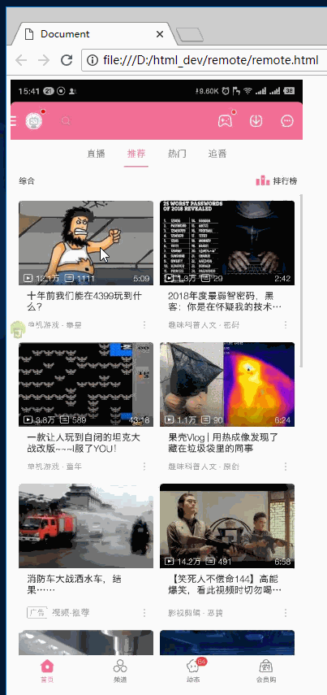

# android-remote-control-by-web

通过web浏览器来远程控制android手机，基于Auto.js

# 功能

1. 支持点击
2. 支持滑动
3. 10帧每秒
4. 画质压缩

# 使用注意事项

1. 需要android7.0以上系统，安装有auto.js，不需要root
2. 请在安全的wifi环境使用
3. 请不要用于作恶
4. 鼠标操作需要等待鼠标左键弹起后才将操作指令发送到手机
5. 如果发现屏幕卡了请刷新一下网页

# TODO

0. back()、home()、powerDialog()、notifications()、recents() 支持
1. 支持键盘输入
2. 支持长按拖拽的操作
5. 身份验证
